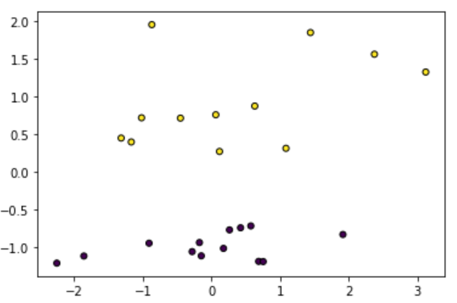
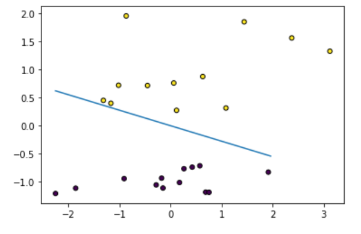

# Team Members

```
Yara Wael >>> ID:1170431
Tasneem Adel >>>ID:1162182

```

```
First of all we had to apply the 2 models on questions 1 & 4 which are
A-Batch Perceptron 
B-Online Batch Perceptron
```
# Algorithms
## A-Batch Perceptron
```
A-Batch Perceptron
Input:(Xm,Ym), m=1,2,.....,N
set W=[0,0,0,......,0].T  # Where T is the transpose
Repeat
    delta=[0,0,0,......,0].T
    for m=1 to N do
        if Ym*(W.Xm) <=0
           delta=delta-YmXm
    delta=delta/N
    W=W-delta
until ||delta||< e  #where e is epslilon , very small valye approaches to 0

*Explanation:*

we begin with intializing learning rate with 1 and itializing weights with a range from -1 t0 1 and also intialize delta to help us know the number of updates taken to reach almost zero error.
upon using random values of weights , generating more epochs until reaching very small value(approaches zero)
in this model the final number of updates must be equal the final number of epochs


```
## B-Online Batch Perceptron
```
Input:(Xm,Ym), m=1,2,.....,N
set W=[0,0,0,......,0].T  # Where T is the transpose
Repeat
    delta=[0,0,0,......,0].T
    for m=1 to N do
        if Ym*(W.Xm) <=0
           delta=delta-YmXm
           W=W-delta/N
until ||delta||< e  #where e is epslilon , very small valye approaches to 0


*Explanation:*

our target is to calculate the total number of epochs reached to achieve almost zero error and calculate number of updated model weights until then.
we begin with 2 features in question #1 (with bias) and  itializing weights with a range from -1 t0 1 
and intializing delta with zeros , delta and weights have to be with the same length , upon multiplications of(W[XY)]) if the result is positive thats mean that our prediction is true , if it is negative so it will be updated.

the difference between the batch perceptron and the online batch perceptron is that in batch perceptron the number of echos is equal to the number of updates , unlike in online batch perceptron the 2 values are different due to the different implement of the code.

```


# A-Batch Preceptron Code


```python
def batch_perceptron(X,Y,lr=1):
    n=X.shape[1]
    w=np.array([float(random.randrange(-100, 100))/100 for _ in range(X.shape[1])])  #generate random values from (-1,1)
    e=sys.float_info.epsilon       #where epsilon is a very small value approaches 0
    delta=np.ones(n)  #intializing delta with array of ones
    delta_total = []  #our target is delta approching to 0
    w_steps=[]   #weights
    
    count=0 #where count= Number of epochs needed to achieve almost zero  error.  
    
    while(norm(delta,1)>e):
        delta=np.zeros(n)
        for i in range(len(X)):
            u=w.dot(X[i])
            if Y[i]*u<=0:
                delta=delta-(Y[i]*X[i])
        delta=delta/len(X)
        
        delta_total.append(norm(delta, 1))     #updating delta
        
        w=w-(lr*delta)
        w_steps.append(w)
        count+=1       #return the total number of epochs
        if count>75:     # because of the infinite loop 
            break    
    return w,w_steps,delta,count,delta_total
```

# B-Online Batch Preceptron Code


```python
def online_batch_perceptron(X,Y,lr=1):
    n=X.shape[1]
    data_length=len(X)
    w=np.array([float(random.randrange(-100, 100))/100 for _ in range(X.shape[1])])
    e=sys.float_info.epsilon
    
    delta=np.ones(n)  #intializing delta with array of ones
    delta_total = []  #our target is delta approching to 0

    w_steps=[]
    count=0
    while(norm(delta,1)>e):
        delta=np.zeros(n)
        for i in range(data_length):
            u=w.dot(X[i])
            if Y[i]*u<=0:
                delta=delta-(Y[i]*X[i])
                delta=delta/data_length
                w=w-(lr*delta)
                w_steps.append(w)
                
        delta_total.append(norm(delta, 1))
        count+=1
        if count>75:     # because of the infinite loop 
            break    
    return w,w_steps,count,delta_total
```

# Problem 1-Batch Perceptron


```python
X=np.array([[50,55,70,80,130,150,155,160],    #x has 2 features
            [1,1,1,1,1,1,1,1]]).T
Y=np.array([1,1,1,1,-1,-1,-1,-1])
w,steps,delta,count, delta_total=batch_perceptron(X,Y)

#printing the values at each run of the random values #output of w,steps and count will differ each time

print (w)          #where w is the weights generated at every run from the random values 
print(len(steps))  #Number of times each algorithm updated model weights.
print(count)           #Number of epochs needed to achieve almost zero error.
```

    [ -2.855 363.63 ]
    1818
    1818
    
    

````
Comment:
1-number of updates=number of epochs
2-if we run this code again the weights ,updates and epochs number will be different as we use random values from -1 to 1

````
# Plotting of Batch Perceptron


```python
#Plot of deltas (changes in weights).

delta_total = np.unique(delta_total)
plt.plot(np.flip(np.arange(0,len(delta_total))),delta_total)
```


    [<matplotlib.lines.Line2D at 0x237a0eb0eb0>]


    

    
```
Comments:
1-every time the weights,delta and count changes it will reflect on the plot
2-our plots should approach to 0 in order to achieve almost zero error

```

# Problem 1-Online Batch Perceptron


```python
X=np.array([[50,55,70,80,130,150,155,160],    #x has 2 features
            [1,1,1,1,1,1,1,1]]).T
Y=np.array([1,1,1,1,-1,-1,-1,-1])

w_online,steps_online,count,delta_total=online_batch_perceptron(X,Y)
print (w_online)     #weights
print(len(steps_online))   #Number of times each algorithm updated model weights.  
print(count)    #epochos

#number of epochos and update number has to be different not the same as in case of batch perceptron
```

    [-0.13410156 11.48443359]
    215
    71
    
```
Comments:
1-Here we observe that the number of updates is not equal to the number of epochos as in the Batch Perceptron model and this is due to the different implementation of online Batch Perceptron as the updates append after continuing the while loop
2-Also like the Batch Perceptron , with every run of the code the weights , updates, and epochos will differ
```
# Plotting of Online Batch Perceptron


```python
#Plot of deltas (changes in weights).

delta_total = np.unique(delta_total)
plt.plot(np.flip(np.arange(0,len(delta_total))),delta_total)
```


    [<matplotlib.lines.Line2D at 0x237a0f174c0>]


    

    


# Problem 4-Batch Perceptron


```python
#as M here is RGB with 3 features and 1 additional feature (bias) , then it is total of 4 features

M= np.array([[0,255,0,0,255,0,255,255],
             [0,0,255,0,255,255,0,255],
             [0,0,0,255,0,255,255,255],
             [1,1,1,1,1,1,1,1]]).T

N=np.array([1,1,1,-1,1,-1,-1,1])         # Where N is the corrseponding values of M (Y in problem 1)
```


```python
w,steps,delta,count, delta_total=batch_perceptron(X,Y)

#printing the values at each run of the random values #output of w,steps and count will differ each time

print (w)          #where w is the weights generated at every run from the random values 
print(len(steps))  #Number of times each algorithm updated model weights.
print(count)           #Number of epochs needed to achieve almost zero error.
```

    [ -6.885 599.89 ]
    3008
    3008
    

# Plotting of Batch Perceptron


```python
#Plot of deltas (changes in weights).

delta_total = np.unique(delta_total)
plt.plot(np.flip(np.arange(0,len(delta_total))),delta_total)
```


    [<matplotlib.lines.Line2D at 0x237a111c880>]


    

    


# Problem 4-Online Batch Perceptron


```python

w_online,steps_online,count,delta_total=online_batch_perceptron(X,Y)
print (w_online)     #weights
print(len(steps_online))   #Number of times each algorithm updated model weights.  
print(count)    #epochos

#number of epochos and update number has to be different not the same as in case of batch perceptron
```

    [-0.02261719  2.79470703]
    41
    15
    

# Plotting of Online Batch Perceptron


```python
#Plot of deltas (changes in weights).

delta_total = np.unique(delta_total)
plt.plot(np.flip(np.arange(0,len(delta_total))),delta_total)
```


    [<matplotlib.lines.Line2D at 0x237a12226d0>]


    

    


 # Repeat all the above using the data generated


```python
x,y = make_classification(25,n_features=2,n_redundant = 0,n_informative=1,n_clusters_per_class=1)

mask_for_y = y == 0
y[mask_for_y] = - 1

plt.scatter(x[:,0],x[:,1],marker='o',s=25, c=y,edgecolor='k')
```


    <matplotlib.collections.PathCollection at 0x237a1281a00>


    

    


# Dividing the data into 75% training and 25% testing
We divided them by using train_test_split function.
```python
from sklearn.model_selection import train_test_split
trainX, testX, trainY, testY = train_test_split(x, y, test_size = 0.25, random_state=0)
```
# Output Results from both Algorithms

## Batch Perceptron Algorithm
Weights: [0.10840586 0.49619529]\
No. of times updated weights: 5\
No. of epochs: 5

## Online Training Algorithm
Weights: [-0.00637506  0.41912691]\
No. of times updated weights: 3\
No. of epochs: 3

# Calculating Model Accuracy
We train a logistic regression model on the training set by defining the model, fit it, make predictions and then evaluate predictions to get accuracy

```python
from sklearn.linear_model import LogisticRegression
from sklearn.metrics import accuracy_score

model = LogisticRegression(random_state = 0)  # define model
model.fit(trainX, trainY)   # fit model
yhat = model.predict(testX)  # make predictions
accuracy = accuracy_score(testY, yhat)    # evaluate predictions

print("yhat:", yhat)
print("testY: ", testY)
print('Accuracy: %.3f' % (accuracy * 100))
```
##  Output:
yhat: [-1 -1 -1 -1  1  1  1]\
testY:  [-1 -1 -1 -1  1  1  1]\
Accuracy: 100.000

# Visualizing The Model

## Batch Perceptron Algorithm


## Online Training Algorithm



# Conclusion 

To put it in a nutshell, the number of epochs required in the Batch Algorithm is equal to the number of times each algorithm updated model weights. Delta in both algorithms must be equal to zero in order for the final weights value to be reached.

